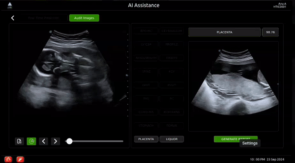
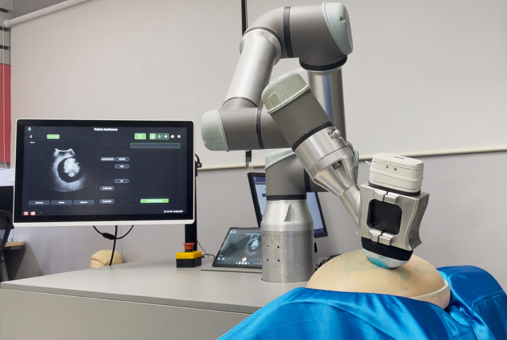
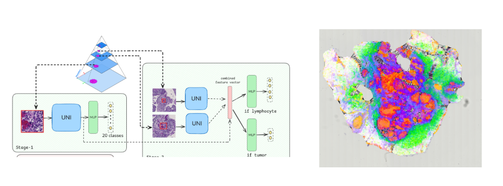
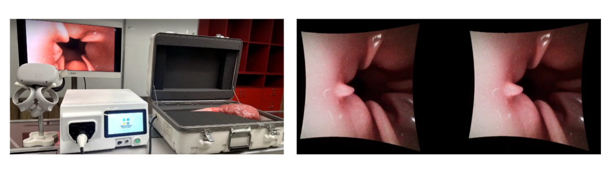
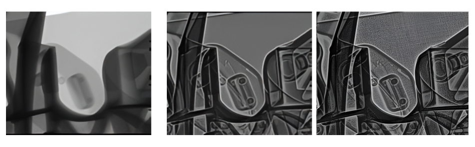

#+TITLE: Projects
#+Author: Lafith Mattara
#+OPTIONS: title:nil

#+HTML: <section class="page-intro">
#+HTML: 
Selected projects across applied AI, robotics, medical imaging, simulation, and visualization.

#+HTML: </section>

* Real-Time Self-Prompting Adaptation of a Foundation Model for Fetal Ultrasound
#+HTML: 
Medical AI / robotics / real-time segmentation

Adapted the Segment Anything (SAM) foundation model to be self-prompting for fetal ultrasound, achieving clinical-grade precision with real-time inference. Deployed in a robotic prototype, the system reduced manual scanning time by over 85%, enabling high-throughput prenatal screening and drawing strong interest from clinicians at the XVIII Clinical Ultrasonography in Practice (CUSP) conference.

#+ATTR_HTML: :width 600px

* Deep Learning-Based Analysis of Breast Cancer Whole Slide Images
#+HTML: 
Digital pathology / deep learning / graph analysis

Developed convolutional and graph neural networks to analyze breast cancer whole slide images, enabling automated patch-level annotation and interpretation. Investigated associations between neighborhood deprivation, the tumor microenvironment, and racial disparities. Findings were presented at two research symposia.

* Stereo-Endoscope VR System for Real-Time Medical Visualization
#+HTML: 
VR / medical imaging / real-time rendering

Designed and built a complete VR application for real-time visualization of stereo-endoscope video streams, integrating video capture, image processing, and 3D rendering. The system was showcased at MEDICA 2024, highlighting its innovation in medical imaging and interactive visualization.

* Contrast Enhancement of Industrial CT Scans Using Multi-Scale Image Processing
#+HTML: 
Image processing / industrial CT / visualization

Enhanced contrast in industrial CT scans using multi-scale image processing techniques. This revealed subtle internal structures, improving clarity for inspection and analysis.

* Autonomous Underwater Vehicle Simulator
#+HTML: 
Unity / ROS / robotics simulation

A 3D underwater simulation environment built in Unity to model the dynamics and control of an Autonomous Underwater Vehicle (AUV). It enables realistic testing of navigation and control algorithms in a virtual underwater setting with support for simulated sensors. Designed for rapid prototyping and validation of AUV software stacks.

*Github Repo* : [[https://github.com/lafith/AUV-Simulator-Unity][AUV-Simulator-Unity]]

[[./media/auv2.gif]]

[[./media/auv1.gif]]
